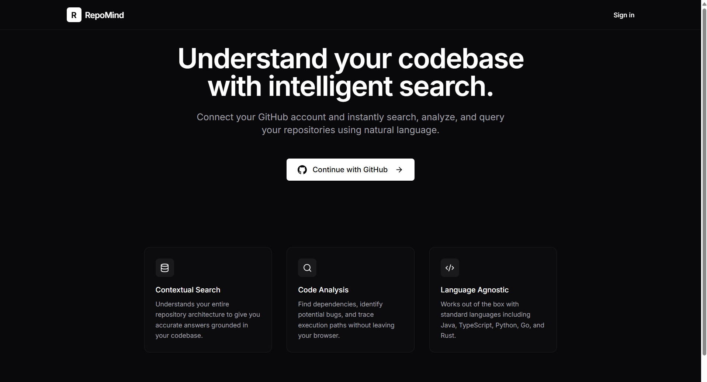
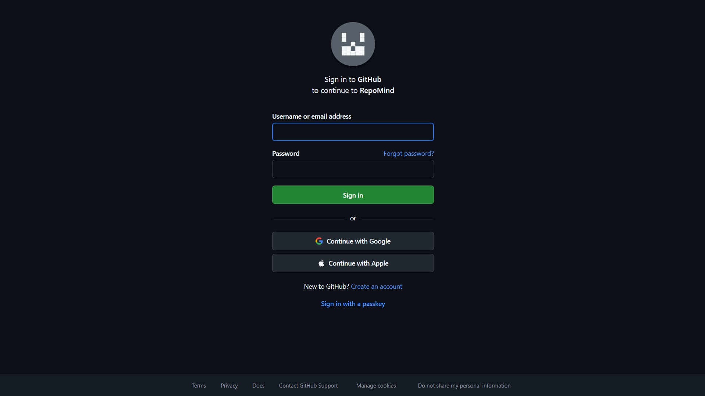
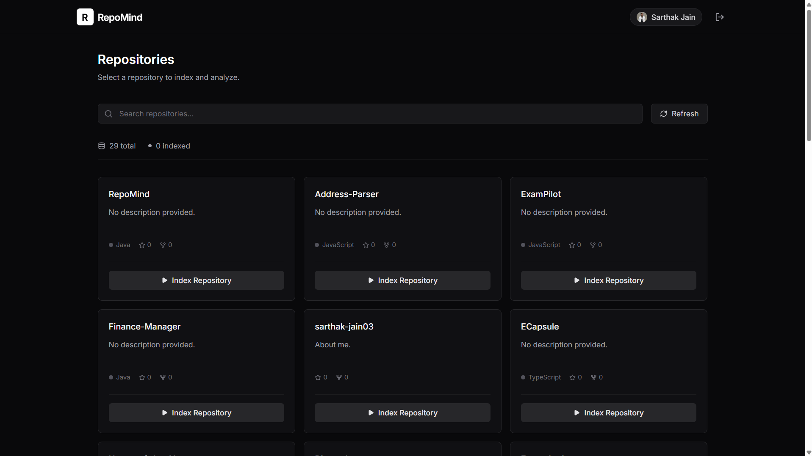
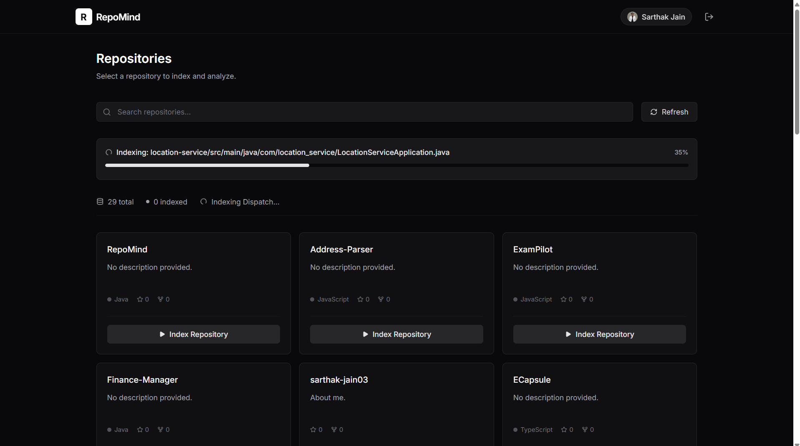
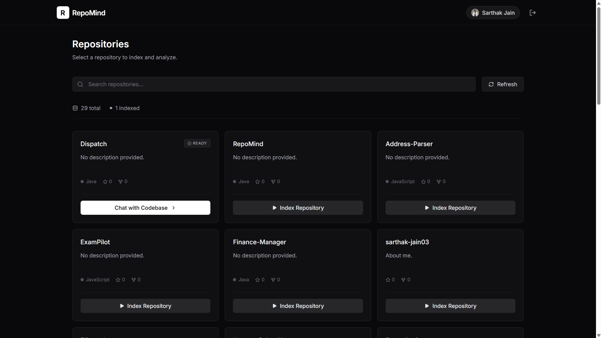
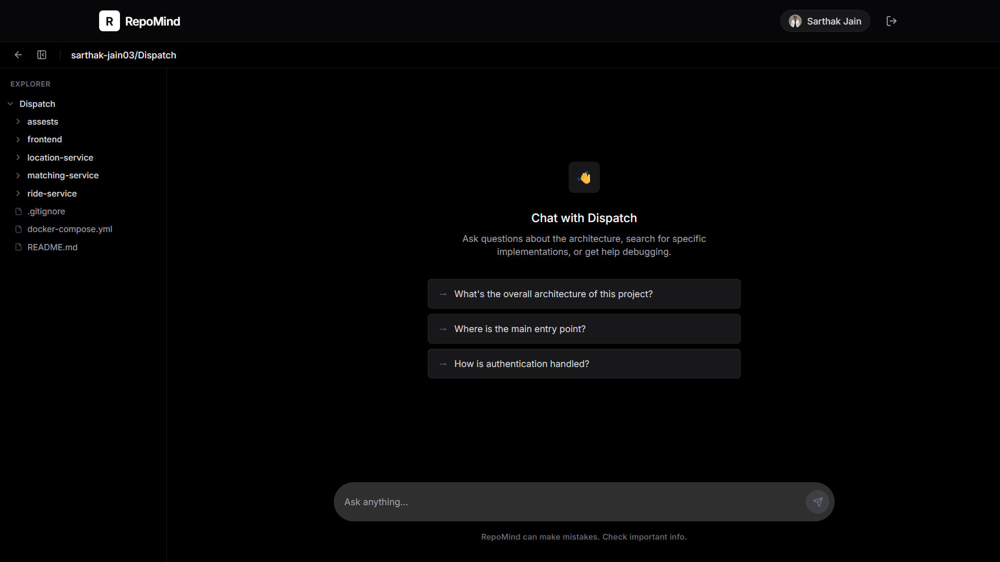
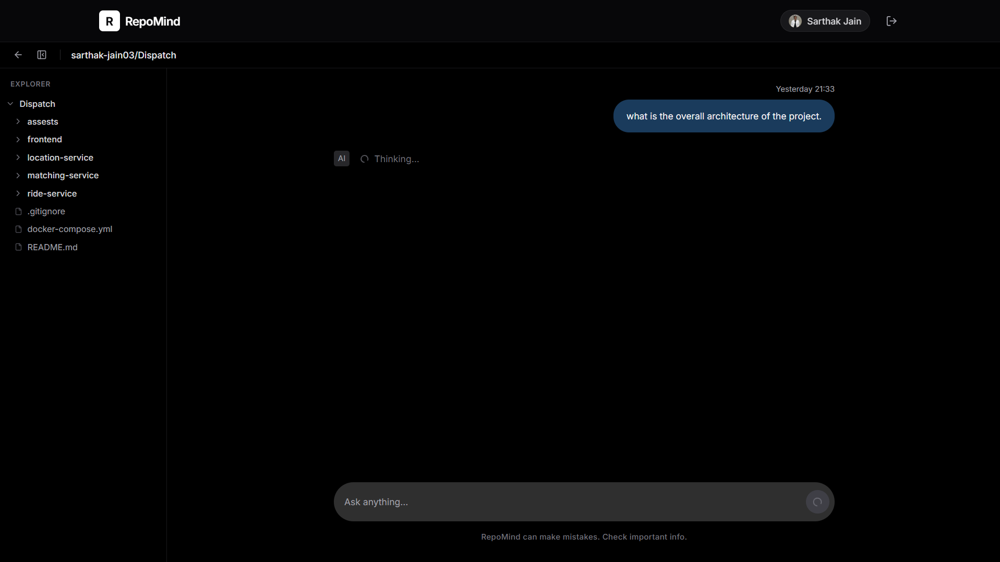
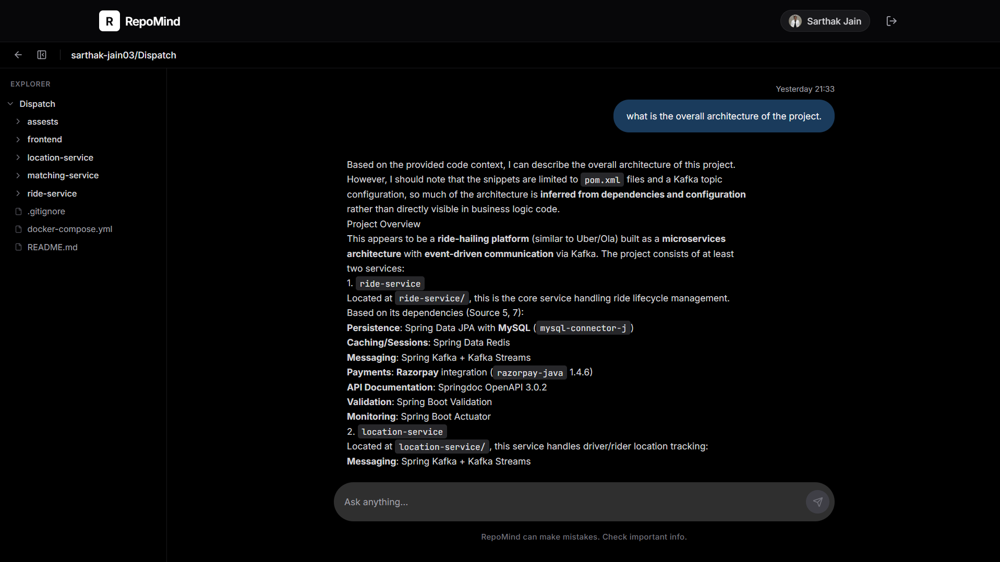
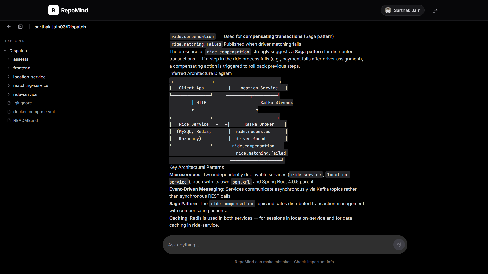
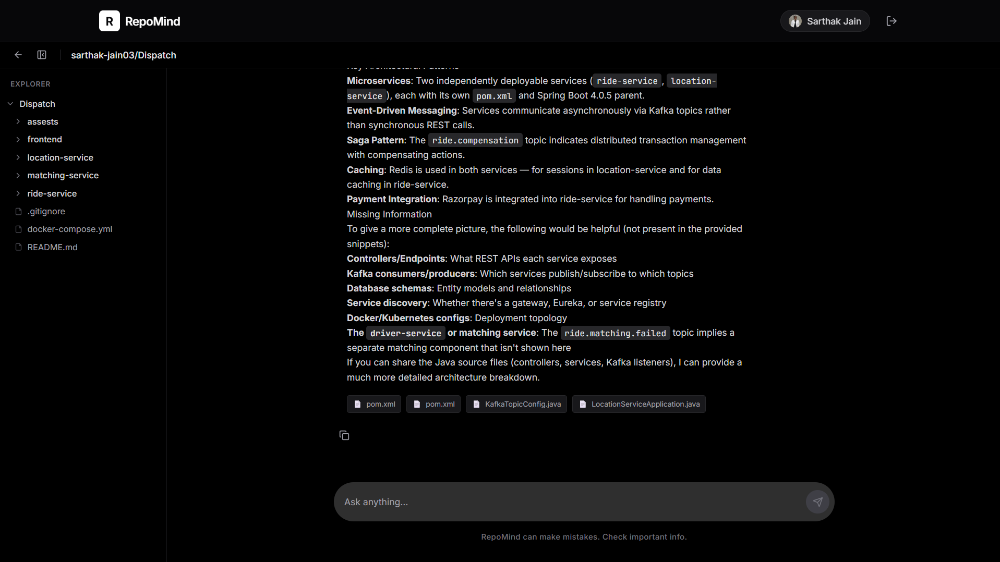

<p align="center">
  <h1 align="center">RepoMind</h1>
  <p align="center">
    <strong>Chat with your GitHub repositories using AI-powered code understanding</strong>
  </p>
</p>

---

RepoMind is a **RAG-powered (Retrieval-Augmented Generation) developer assistant** that connects to your GitHub account, indexes your repositories, and lets you ask natural-language questions about your codebase. Get accurate, source-referenced answers grounded in your actual code.

Live Link: https://repomind-rho.vercel.app



## Features

-  **GitHub OAuth2 Authentication** — Secure login with your GitHub account
-  **Repository Sync** — Automatically fetches and displays all your repositories
-  **Smart Indexing** — Chunks and embeds code files with real-time progress tracking
-  **AI Chat Interface** — Ask natural-language questions about your codebase
-  **Source References** — Every answer includes exact file paths and line numbers
-  **File Explorer** — Browse repository structure in a collapsible tree view
-  **Markdown Rendering** — AI responses with syntax-highlighted code blocks
-  **Copy to Clipboard** — One-click copy for AI responses
-  **Mobile Responsive** — Fully functional on mobile devices

## Tech Stack

### Backend
| Technology | Purpose |
|-----------|---------|
| **Java 17** | Core language |
| **Spring Boot 3.2** | Application framework |
| **Spring Security** | OAuth2 + JWT authentication |
| **Spring Data JPA** | ORM and data access |
| **PostgreSQL** | Primary database |
| **pgvector** | Vector similarity search for embeddings |
| **Fireworks.ai** | LLM (DeepSeek-v4-flash) and embeddings (nomic-embed-text-v1.5) |
| **Docker** | Containerized PostgreSQL with pgvector |

### Frontend
| Technology | Purpose |
|-----------|---------|
| **React 19** | UI framework |
| **Vite** | Build tool and dev server |
| **React Router v7** | Client-side routing |
| **Tailwind CSS** | Utility-first styling |
| **Axios** | HTTP client with interceptors |
| **Lucide React** | Icon library |

## Architecture

```
┌─────────────────────────────────────────────────────────────────┐
│                         Frontend (React + Vite)                 │
│  ┌──────────┐  ┌──────────────┐  ┌──────────┐  ┌───────────┐    │
│  │ Landing  │  │  Dashboard   │  │   Chat   │  │   Auth    │    │
│  │  Page    │  │    Page      │  │   Page   │  │ Callback  │    │
│  └──────────┘  └──────────────┘  └──────────┘  └───────────┘    │
│                    Axios + JWT Token                            │
└────────────────────────────┬────────────────────────────────────┘
                             │ REST API
┌────────────────────────────┴────────────────────────────────────┐
│                    Backend (Spring Boot)                        │
│                                                                 │
│  ┌─────────────────────── Controllers ──────────────────────┐   │
│  │  AuthController  │  GitHubController  │  ChatController  │   │
│  └──────────────────────────────────────────────────────────┘   │
│                             │                                   │
│  ┌─────────────────────── Services ─────────────────────────┐   │
│  │                                                          │   │
│  │  ┌──────────────┐  ┌──────────────┐  ┌───────────────┐   │   │
│  │  │ GitHubService│  │IndexingService│  │  ChatService  │  │   │
│  │  │  (API calls) │  │ (async index) │  │ (orchestrate) │  │   │
│  │  └──────────────┘  └──────┬───────┘  └───────┬───────┘   │   │
│  │                           │                   │          │   │
│  │  ┌──────────────┐  ┌─────┴──────┐  ┌────────┴───────┐    │   │
│  │  │ CodeChunker  │  │ Embedding  │  │   RagService   │    │   │
│  │  │ (split code) │  │  Service   │  │(retrieve+gen)  │    │   │
│  │  └──────────────┘  └────────────┘  └────────────────┘    │   │
│  └──────────────────────────────────────────────────────────┘   │
│                             │                                   │
│  ┌──────────────── Security Layer ──────────────────────────┐   │
│  │  OAuth2 Success Handler → JWT Filter → Security Config   │   │
│  └──────────────────────────────────────────────────────────┘   │
└────────────────────────────┬────────────────────────────────────┘
                             │
              ┌──────────────┴──────────────┐
              │                             │
     ┌────────┴────────┐          ┌────────┴────────┐
     │   PostgreSQL    │          │  Fireworks.ai   │
     │   + pgvector    │          │   (LLM + Embed) │
     │                 │          │                 │
     │ • users         │          │ • Chat API      │
     │ • repositories  │          │ • Embeddings API│
     │ • code_chunks   │          │                 │
     │ • chat_messages │          │                 │
     └─────────────────┘          └─────────────────┘
```

### RAG Pipeline Flow

```
User Question
      │
      ▼
┌─────────────┐     ┌──────────────┐     ┌────────────────┐
│  Generate   │────▶│  pgvector    │────▶│  Top-8 Code    │
│  Embedding  │     │  Similarity  │     │  Chunks        │
│  (query)    │     │  Search      │     │  Retrieved     │
└─────────────┘     └──────────────┘     └───────┬────────┘
                                                  │
                                                  ▼
                                         ┌────────────────┐
                                         │  Build Context │
                                         │  + System      │
                                         │  Prompt        │
                                         └───────┬────────┘
                                                  │
                                                  ▼
                                         ┌────────────────┐
                                         │  LLM Chat      │
                                         │  Completion    │
                                         │  (Fireworks)   │
                                         └───────┬────────┘
                                                  │
                                                  ▼
                                         ┌────────────────┐
                                         │  Response +    │
                                         │  Source Refs   │
                                         └────────────────┘
```

## Screenshots

### Landing Page & Login



### Dashboard


### Indexing Progress



### Chat Interface



### Output Highlights





## Getting Started

### Prerequisites

- **Java 17+**
- **Node.js 18+** and npm
- **Docker** (for local PostgreSQL with pgvector)
- **GitHub OAuth App** (for authentication)
- **Fireworks.ai API Key** (for LLM and embeddings)

### 1. Clone the Repository

```bash
git clone https://github.com/sarthak-jain03/RepoMind.git
cd RepoMind
```

### 2. Set Up GitHub OAuth App

1. Go to [GitHub Developer Settings](https://github.com/settings/developers)
2. Click **New OAuth App**
3. Set:
   - **Application name**: `RepoMind`
   - **Homepage URL**: `http://localhost:5173`
   - **Authorization callback URL**: `http://localhost:8080/login/oauth2/code/github`
4. Note down the **Client ID** and **Client Secret**

### 3. Get Fireworks.ai API Key

1. Sign up at [fireworks.ai](https://fireworks.ai)
2. Navigate to API Keys and create a new key

### 4. Start the Database

```bash
cd backend
docker-compose up -d
```

This starts a PostgreSQL 16 instance with the pgvector extension enabled.


### 5. Configure Backend

Create or update `backend/.env`:

```env
SPRING_DATASOURCE_URL=jdbc:postgresql://localhost:5432/repomind
SPRING_DATASOURCE_USERNAME=repomind
SPRING_DATASOURCE_PASSWORD=repomind123

GITHUB_CLIENT_ID=your_github_client_id
GITHUB_CLIENT_SECRET=your_github_client_secret

JWT_SECRET=your_jwt_secret_at_least_64_characters_long_for_hmac_sha_signing
FIREWORKS_API_KEY=your_fireworks_api_key

FRONTEND_URL=http://localhost:5173
BACKEND_URL=http://localhost:8080
```

### 6. Run the Backend

```bash
cd backend
./mvnw spring-boot:run
```

The backend starts on `http://localhost:8080`.

### 7. Configure Frontend

Create or update `frontend/.env`:

```env
VITE_API_BASE_URL=http://localhost:8080
```

### 8. Run the Frontend

```bash
cd frontend
npm install
npm run dev
```

The frontend starts on `http://localhost:5173`.

### 9. Use the App

1. Open `http://localhost:5173`
2. Click **Continue with GitHub** to authenticate
3. Select a repository from your dashboard
4. Click **Index Repository** and wait for indexing to complete
5. Click **Chat with Codebase** and start asking questions!

## Project Structure

```
RepoMind/
├── backend/
│   ├── src/main/java/com/repomind/
│   │   ├── RepoMindApplication.java        # Entry point (@EnableAsync)
│   │   ├── config/
│   │   │   ├── SecurityConfig.java          # Spring Security + OAuth2 + JWT
│   │   │   ├── JwtTokenProvider.java        # JWT generation & validation
│   │   │   ├── JwtAuthenticationFilter.java # JWT request filter
│   │   │   ├── OAuth2AuthenticationSuccessHandler.java  # OAuth2 → JWT redirect
│   │   │   ├── CorsConfig.java              # CORS configuration
│   │   │   └── WebClientConfig.java         # WebClient with 16MB buffer
│   │   ├── controller/
│   │   │   ├── AuthController.java          # /api/auth/* endpoints
│   │   │   ├── ChatController.java          # /api/chat/* endpoints
│   │   │   └── GitHubController.java        # /api/github/* endpoints
│   │   ├── dto/
│   │   │   ├── ChatRequest.java             # Chat input DTO
│   │   │   ├── ChatResponse.java            # Chat output DTO + SourceReference
│   │   │   ├── IndexingStatusDto.java       # Indexing progress DTO
│   │   │   └── RepoDto.java                 # Repository data DTO
│   │   ├── model/
│   │   │   ├── User.java                    # User entity
│   │   │   ├── Repository.java              # Repository entity + IndexStatus enum
│   │   │   ├── CodeChunk.java               # Code chunk with vector(768) embedding
│   │   │   └── ChatMessage.java             # Chat message entity
│   │   ├── repository/
│   │   │   ├── UserRepository.java
│   │   │   ├── RepoRepository.java
│   │   │   ├── CodeChunkRepository.java     # pgvector similarity search query
│   │   │   └── ChatMessageRepository.java
│   │   └── service/
│   │       ├── GitHubService.java           # GitHub REST API integration
│   │       ├── IndexingService.java         # Async repo indexing pipeline
│   │       ├── CodeChunker.java             # Code splitting with overlap
│   │       ├── EmbeddingService.java        # Fireworks.ai embedding API
│   │       ├── VectorStoreService.java      # pgvector search abstraction
│   │       ├── RagService.java              # RAG pipeline (retrieve + generate)
│   │       └── ChatService.java             # Chat orchestration + persistence
│   ├── src/main/resources/
│   │   ├── application.yml                  # Spring configuration
│   │   └── schema.sql                       # pgvector extension setup
│   ├── docker-compose.yml                   # PostgreSQL + pgvector container
│   └── pom.xml                              # Maven dependencies
│
└── frontend/
    ├── src/
    │   ├── App.jsx                          # Root + routing + ProtectedRoute
    │   ├── main.jsx                         # Entry point
    │   ├── components/
    │   │   ├── ChatBubble.jsx               # Message with markdown + sources
    │   │   ├── FileTree.jsx                 # Hierarchical file explorer
    │   │   ├── IndexingProgress.jsx         # Progress bar component
    │   │   ├── LoadingSpinner.jsx           # Loading indicator
    │   │   ├── Navbar.jsx                   # Top navigation with user info
    │   │   └── RepoCard.jsx                 # Repository card (index/chat actions)
    │   ├── pages/
    │   │   ├── LandingPage.jsx              # Hero + features + CTA
    │   │   ├── DashboardPage.jsx            # Repo list + search + indexing
    │   │   ├── ChatPage.jsx                 # Chat UI + sidebar + input
    │   │   └── AuthCallback.jsx             # OAuth2 token handler
    │   └── services/
    │       ├── api.js                       # Axios instance + interceptors
    │       ├── authService.js               # Auth methods (login, logout, etc.)
    │       ├── chatService.js               # Chat API calls
    │       └── repoService.js               # Repository API calls
    ├── package.json
    ├── vite.config.js
    ├── tailwind.config.js
    └── vercel.json                          # Vercel SPA routing config
```

## API Endpoints

### Authentication
| Method | Endpoint | Description |
|--------|----------|-------------|
| `GET` | `/oauth2/authorization/github` | Initiate GitHub OAuth2 login |
| `GET` | `/api/auth/me` | Get current authenticated user |
| `GET` | `/api/auth/validate` | Validate JWT token |

### Repositories
| Method | Endpoint | Description |
|--------|----------|-------------|
| `GET` | `/api/github/repos` | List user's GitHub repositories |
| `POST` | `/api/github/repos/:id/index` | Start indexing a repository |
| `GET` | `/api/github/repos/:id/index/status` | Get indexing progress |
| `GET` | `/api/github/repos/:id/tree` | Get repository file tree |

### Chat
| Method | Endpoint | Description |
|--------|----------|-------------|
| `POST` | `/api/chat` | Send a message (body: `{ repoId, message }`) |
| `GET` | `/api/chat/history/:repoId` | Get chat history for a repository |


## How It Works

1. **Authenticate** — User logs in via GitHub OAuth2. Backend generates a JWT containing the GitHub access token.

2. **Sync Repositories** — Backend fetches the user's repos from GitHub API and stores them in the database.

3. **Index Repository** — When triggered:
   - Fetches the file tree using GitHub's Git Trees API
   - Filters for code files (skips binaries, `node_modules`, etc.)
   - Fetches each file's content and splits it into overlapping chunks (~1500 chars)
   - Generates 768-dimensional embeddings via Fireworks.ai (nomic-embed-text-v1.5)
   - Stores chunks + embeddings in PostgreSQL with pgvector

4. **Chat with Code** — When the user asks a question:
   - Generates an embedding of the question
   - Performs cosine similarity search against stored code chunks (top-8)
   - Builds a context prompt with the retrieved code snippets
   - Sends to Fireworks.ai LLM (DeepSeek-v4-flash) with strict grounding rules
   - Returns the answer with source file references

## Contributing

Contributions are welcome! Please feel free to submit a Pull Request.

## Author
- Sarthak Jain
- Email: sarthakjain4452@gmail.com
